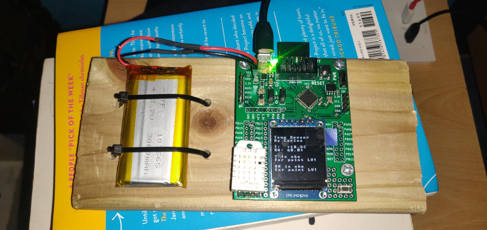

# DEMO TERMITE
This is a demo for the termite board. It uses a am2302 temperature sensor and outputs it a st7789 display. 
The demo will display the current temperature and relative humidity. It will also show if the conditions
are oke for painting the boats of my local scouting. 

